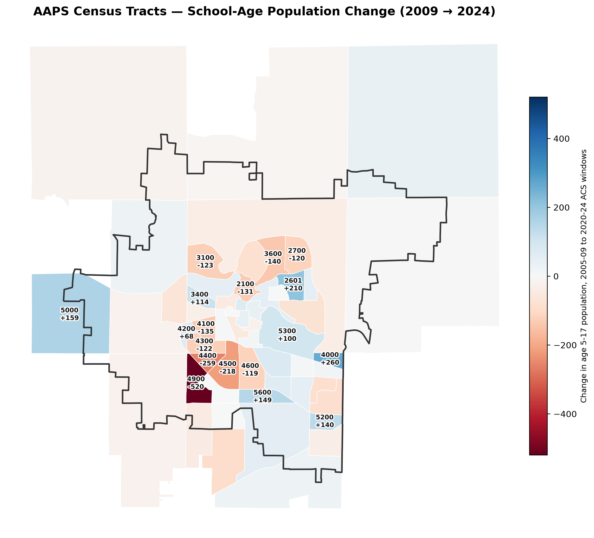

```{r setup, include=FALSE}
knitr::opts_chunk$set(echo = FALSE, warning = FALSE, message = FALSE, fig.width = 10, fig.height = 5.5, dpi = 200)
library(tidyverse)
library(ggsci)
library(scales)
library(patchwork)
library(kableExtra)

pal <- pal_jama()(7)
theme_set(
  theme_minimal(base_size = 12) +
    theme(
      plot.title = element_text(face = "bold", size = 14),
      plot.subtitle = element_text(color = "grey40", margin = margin(b = 10)),
      plot.caption = element_text(color = "grey50", hjust = 0, face = "italic", size = 8),
      legend.position = "bottom",
      panel.grid.minor = element_blank()
    )
)
```

# Executive Summary

Ann Arbor Public Schools (AAPS) faces a structural fiscal crisis driven by a declining school-age population, a state funding formula tied to per-pupil counts, and a decade of staffing growth that preceded the 2024 budget shock. This report consolidates four parallel research tracks (district and government sources, state-level policy, social media sentiment, and local journalism) with a tract-level demographic analysis of the district's population from ACS 5-year data covering 2005-2009 through 2020-2024.

**Key findings:**

1. **The district is aging, not shrinking.** Total population inside AAPS boundaries grew 6.8% (160,316 to 171,139) over 15 years, while the school-age population (5-17) fell 8.0% (19,840 to 18,249) and the future-entrant pool (0-4) fell 12.7% (7,981 to 6,965) with no recovery inflection as of the latest window.
2. **No official closure list exists.** The "2 to 6 schools" figure traces to a single paywalled Ann Arbor Observer article (Aug 26, 2026). District officials state no closure vote will occur before the 2026-2031 strategic plan process concludes; official modeling puts savings at \$6.75-7M annually plus \$8.5-9.5M one-time from property sales.
3. **The 2024 "\$25M budget error" narrative is contested.** The Plante Moran forensic review found the \$14M pension-transfer misposting had zero net impact on fund balance; the primary driver was a ~\$12M across-the-board raise approved March-April 2023 without matching revenue.
4. **Geographic divergence is the strongest closure predictor.** Inner-ring tracts lost school-age population at rates up to -50% over 15 years while southern new-development tracts grew up to +87%. Closure pressure will fall disproportionately on inner-ring elementary schools.
5. **The November 3, 2026 board election (5 of 7 seats) is the pivotal political window**, with the teachers' union having passed no-confidence votes against two incumbent trustees and a short-term contract (through Dec 2027) that defers but does not resolve labor costs.

\newpage

# Part I: Fiscal Structure - Why a Wealthy District Runs Deficits

## The Two-Ledger System (Proposal A, 1994)

Michigan's 1994 constitutional amendment (Proposal A) split every district's finances into two sealed ledgers. Capital projects (new buildings) are funded by local property taxes and voter-approved bonds; operating costs (salaries, buses, utilities) are funded by the state on a per-pupil basis. Money cannot move between them. This is why AAPS can simultaneously build new schools from its 2019 \$1B bond while cutting operating staff: the bond proceeds cannot legally pay a single teacher salary.

The 2019 bond's purchasing power has since collapsed under 44.4% construction inflation. In February 2026 the district announced no new projects would break ground this year: four elementary rebuilds (Mitchell, Dicken, Logan, Thurston) continue; eight projects (Abbot, Carpenter, King, Lakewood, Lawton, Pittsfield, Wines, Pathways) are frozen pending re-estimation, with recommendations due end of 2026. A sinking-fund renewal (2.4031 mills, \$33.8M first year) passed August 4, 2026 with 74.2% support; without it the district faced a \$582.7M capital gap and negative cash flow by 2028.

## The Operating Ledger

AAPS' 2026-27 budget carries a \$4.27M structural deficit (revenue \$312.77M vs expenditures \$317.04M), covered by fund balance, which ends the year at 5.05% of expenditures - one-tenth of the ~22% state average and barely above the 5% state oversight threshold. The new CFO (Ante Britten, appointed March 2026 after the position sat vacant for 2.5 years - the vacancy coinciding with the budget-error period) has called this level "dangerously low."

Salaries and benefits consume 79.6% of general-fund spending. The district added roughly 480 positions (2024 superintendent's letter; the budget briefing states +272 FTE - the discrepancy is unresolved) over a decade while enrollment fell back to early-2010s levels.

## The 2024 Budget Shock and Its contested Narrative

In spring 2024, a third-party forensic review (Plante Moran) found that the budget had been built by copying the prior year's spreadsheet: a \$14M state pension transfer (MPSERS 147c2) was recorded as revenue without the matching expenditure. Early media framed this as a "\$25M accounting error." The forensic report's actual finding was that the misposting had **zero net impact on fund balance**; the real driver was the ~\$12M compensation increase approved by the board in March-April 2023, which would have required 1,130+ additional students to balance. The superintendent at the time (Jeanice Swift) was bought out in September 2023 (18 months' salary, ~\$345K). Current superintendent Jazz Parks earns \$256,000 under a contract through June 2027.

## State Funding Environment

Per-pupil foundation allowances rose two consecutive years: \$10,050 in 2025-26 (+4.6%, PA 15 of 2025) and \$10,300 in 2026-27 (+2.5%, PA 25 of 2026, signed July 21, 2026). AAPS, as a hold-harmless district, receives more (~\$11,172), but enrollment decline (16,956 to ~16,372 over five years) has shrunk the total foundation from \$179.6M to \$175.2M. The July 2026 package (SB 903 + HB 5630 Sec. 22b) created the largest formula change since Proposal A - weighted funding for at-risk and ELL students phasing in over 15 years (+\$278M statewide, +20%) - but moves by statute, not constitutional amendment; Proposal A's capital/operating wall stands.

AAPS is under no state intervention: it is absent from the Early Warning list (28 districts), the deficit-elimination list (4 districts), and has no state oversight. It entered and exited Treasury's "potential fiscal stress" monitoring between June 2024 and December 2025.

The Washtenaw Intermediate School District functions as the county-level relief valve: a special-education millage renewal (2.3826 mills, 12 years, ~\$56.9M/year) shields AAPS from ~\$25M/year of mandated special-education costs, and a new CTE millage (1 mill, ~\$25M/year) passed in 2025.

## The Tax-Base Squeeze from City Hall

In May 2026 the county approved a \$300M "Ann Arbor South" brownfield TIF that will capture roughly \$135M of school-district education tax over 30 years. The district publicly opposed it and lost. City and county economic-development decisions are actively eroding the district's tax base - a structural headwind independent of enrollment.

\newpage

# Part II: Demographic Analysis - A District Aging in Place

```{r data}
ts <- read.csv("/tmp/aaps-research/population/aaps_tract_age_timeseries.csv",
               colClasses = c(GEOID = "character"))
ts$end_year <- as.integer(sub(".*-", "", ts$year_window))

# district-level summary (weighted)
summ <- ts %>%
  filter(age_band %in% c("total", "0-4", "5-9", "10-14", "15-17")) %>%
  group_by(end_year, age_band) %>%
  summarise(est = sum(weighted_estimate), moe = sqrt(sum(weighted_moe^2)), .groups = "drop")

dist <- summ %>% mutate(age_band = factor(age_band, levels = c("total", "0-4", "5-9", "10-14", "15-17")))

# school-age derived
s517 <- summ %>% filter(age_band %in% c("5-9", "10-14", "15-17")) %>%
  group_by(end_year) %>%
  summarise(est = round(sum(est)), moe = sqrt(sum(moe^2)), .groups = "drop")
```

## Fifteen-Year Age-Structure Trend

```{r fig-trend, fig.cap="AAPS district age structure, ACS 5-year windows 2009-2024. Shaded band: 90% margin of error (independent-sum approximation). Non-overlapping anchor windows marked."}
p1 <- ggplot() +
  geom_ribbon(data = filter(dist, age_band == "0-4"),
              aes(x = end_year, ymin = est - moe, ymax = est + moe), fill = pal[6], alpha = 0.15) +
  geom_line(data = filter(dist, age_band == "0-4"), aes(end_year, est), color = pal[6], linewidth = 1.3) +
  geom_point(data = filter(dist, age_band == "0-4"), aes(end_year, est), color = pal[6], size = 2.2) +
  geom_ribbon(data = s517, aes(x = end_year, ymin = est - moe, ymax = est + moe), fill = pal[1], alpha = 0.15) +
  geom_line(data = s517, aes(end_year, est), color = pal[1], linewidth = 1.6) +
  geom_point(data = s517, aes(end_year, est), color = pal[1], size = 2.6) +
  geom_point(data = filter(s517, end_year %in% c(2009, 2014, 2019, 2024)), aes(end_year, est), color = pal[1], size = 4.5, shape = 21, stroke = 1.4) +
  geom_text(data = filter(s517, end_year %in% c(2009, 2014, 2019, 2024)),
            aes(end_year, est, label = format(est, big.mark = ",")), vjust = -1.6, size = 3.4, fontface = "bold") +
  scale_y_continuous(labels = label_number(), limits = c(6000, 22500)) +
  labs(title = "School-Age vs. Future-Entrant Population - 15-Year Trend",
       subtitle = "Age 5-17 (school-age) vs age 0-4 (future kindergarten entrants), AAPS boundary, 63 tracts area-weighted",
       x = "ACS 5-year window ending year", y = "Population",
       caption = "Source: ACS 5-year estimates via Census bulk files; AAPS boundary (TIGER 2024). Circled points = non-overlapping anchor windows.") +
  theme(legend.position = "none")

p2 <- ggplot(filter(dist, age_band != "total"), aes(end_year, est, color = age_band)) +
  geom_line(linewidth = 1.2) + geom_point(size = 2) +
  scale_color_jama(labels = c("0-4 (preschool)", "5-9 (elementary)", "10-14 (middle)", "15-17 (high)")) +
  scale_y_continuous(labels = label_number()) +
  labs(title = "By School Level",
       x = "ACS window ending year", y = "Population",
       caption = "Source: ACS 5-year estimates, AAPS boundary tracts.") +
  guides(color = guide_legend(nrow = 1, title = NULL))

p1 / p2
```

The district-level numbers (Table 1) show the pattern: **total population up 6.8%, school-age down 8.0%, future entrants down 12.7%.** The district is not losing residents; it is losing children. The 0-4 cohort sits at its 15-year low in the 2020-2024 window with no recovery inflection - meaning elementary enrollment pressure continues at least through 2030.

```{r table-summary}
anch <- summ %>%
  filter(end_year %in% c(2009, 2014, 2019, 2024), age_band != "total") %>%
  select(end_year, age_band, est) %>%
  pivot_wider(names_from = age_band, values_from = est) %>%
  mutate(`5-17` = `5-9` + `10-14` + `15-17`) %>%
  select(`Window ending` = end_year, `0-4`, `5-9`, `10-14`, `15-17`, `5-17`) %>%
  mutate(across(where(is.numeric), ~ format(round(.x), big.mark = ",")))

knitr::kable(anch, caption = "Non-overlapping anchor windows (independent samples). Source: ACS 5-year estimates, AAPS boundary, 63 tracts area-weighted.")
```

\newpage

# Part III: Geographic Divergence - Where the Children Left

```{r geo}
# tract-level 5-17 change, earliest vs latest non-overlapping windows
w09 <- ts %>% filter(year_window == "2005-2009", age_band %in% c("5-9", "10-14", "15-17")) %>%
  group_by(GEOID, tract_name) %>% summarise(e09 = sum(weighted_estimate), .groups = "drop")
w24 <- ts %>% filter(year_window == "2020-2024", age_band %in% c("5-9", "10-14", "15-17")) %>%
  group_by(GEOID) %>% summarise(e24 = sum(weighted_estimate), .groups = "drop")
chg <- left_join(w09, w24, by = "GEOID") %>%
  mutate(delta = e24 - e09, pct = ifelse(e09 >= 100, round(100 * delta / e09), NA)) %>%
  arrange(desc(delta))
```

```{r fig-geo, fig.height=6, fig.cap="Largest school-age population changes by tract, 2005-09 to 2020-24 windows. Left: absolute change; right: percent change (tracts with 2009 base of at least 100). Labels placed inside panel bounds."}
top_loss <- chg %>% filter(delta < 0) %>% head(10)
top_gain <- chg %>% filter(delta > 0) %>% head(10)
both <- bind_rows(top_loss, top_gain) %>% mutate(dir = ifelse(delta < 0, "Loss", "Gain"))

pA <- ggplot(both, aes(x = delta, y = reorder(tract_name, delta), fill = dir)) +
  geom_col(width = 0.7) +
  scale_fill_manual(values = c(Gain = pal[5], Loss = pal[2]), guide = "none") +
  scale_x_continuous(labels = label_number(sign = TRUE),
                     expand = expansion(mult = c(0.16, 0.16))) +
  geom_text(aes(label = paste0(ifelse(delta > 0, "+", ""), format(round(delta), big.mark = ","))),
            hjust = "inward", size = 3, fontface = "bold") +
  labs(title = "Absolute Change (top 10 each direction)",
       x = "Change in 5-17 population", y = NULL,
       caption = "Source: ACS 5-year, AAPS tracts.") +
  theme(axis.text.y = element_text(size = 8.5))

pct_dat <- chg %>% filter(!is.na(pct)) %>%
  mutate(extreme = pct <= -30 | pct >= 30) %>%
  filter(extreme | abs(delta) >= 120)

pB <- ggplot(pct_dat, aes(x = pct, y = reorder(tract_name, pct))) +
  geom_col(aes(fill = pct > 0), width = 0.7, show.legend = FALSE) +
  scale_fill_manual(values = c(`TRUE` = pal[5], `FALSE` = pal[2])) +
  scale_x_continuous(labels = percent_format(scale = 1),
                     expand = expansion(mult = c(0.18, 0.18))) +
  geom_text(aes(label = paste0(pct, "%")), hjust = "inward", size = 3, fontface = "bold") +
  labs(title = "Percent Change (base >= 100)",
       x = "% change 2009-2024", y = NULL,
       caption = "Source: ACS 5-year, AAPS tracts.") +
  theme(axis.text.y = element_text(size = 8.5))

pA | pB
```

```{r fig-map, fig.cap="Choropleth of census-tract school-age population change. Red = loss, blue = gain; bold labels mark tracts with absolute change of at least 100 or relative change of at least 40% (base at least 100). Black outline: AAPS district boundary (TIGER 2024).", out.width="100%"}

```

The spatial pattern is stark. The heaviest losses cluster in inner-ring tracts (e.g., tract 4149 lost roughly half its school-age population, -520; tracts 4044 and 4045 follow), while growth concentrated in southern new-development areas (tract 4140 +87%/+260; tracts 4550 and 4056 also gained). Elementary attendance areas anchored in inner-ring neighborhoods face the most acute pressure; the district's own capacity-utilization modeling and the 2019 bond's rebuild list (Mitchell, Dicken, Logan, Thurston - all southern or eastern) already reflect a southward demographic tilt.

## Interpretation for Closure Risk

Three factors compound the demographic arithmetic for specific schools: (1) small inner-ring schools with aging buildings deferred from the bond rebuild list; (2) attendance areas overlying the steepest-decline tracts; (3) proximity to a newer, larger replacement school that could absorb enrollment. No public list of candidate schools exists as of this writing (September 9, 2026); any specific names circulating on social media are unverified. The board's stated timeline - decision in fall 2026, effective fall 2027 - places the announcement within roughly two to four months of this report.

\newpage

# Part IV: Social and Political Landscape

## Labor

The teachers' union (AAEA) worked without a contract from December 31, 2025, engaging in work-to-rule from February 2026. A first tentative agreement was rejected 99.6% by members in April (the first such rejection since 1994). A short-term agreement through December 2027 passed 58%-42% on September 4, 2026 - one day before this report - trading a 1.5% raise and a top-scale step for the withdrawal of a class-size +3 proposal and planning-time concessions. The union's no-confidence votes against trustees Baskett and Schmidt (June 2026) formalized labor-board hostility entering the November election.

Local teacher testimony on Reddit corroborates attrition pressure: self-reported exits of 11-13 staff from a single elementary school, dual-teacher households claiming \$60K/year more in neighboring districts, and salary comparisons (Wayne-Westland +\$15K) - all unverified but directionally consistent with Michigan State University research finding Michigan teachers' real wages declined more than any state's over the past decade.

## The November 3, 2026 Election

Five of seven board seats are on the ballot; eight candidates have filed for four seats. The election has become a referendum on the crisis, with Rep. Rashida Tlaib and Our Revolution backing candidate Rima Mohammad. No recall campaign against sitting board members has materialized. The closure-decision timeline (post-election lame-duck window) has drawn community suspicion of deliberate vote-avoidance, though this remains an unverified inference.

## Community Factions

Public sentiment on r/AnnArbor splits into a dominant accountability faction (blaming the administration, with calls for Superintendent Parks to resign) and a structural-funding faction (blaming Proposal A and per-pupil state funding, advocating a countywide operating millage). Teacher first-person testimony clusters on Reddit; X/Twitter discussion is dominated by institutional accounts with far less first-hand content. No specific school names have circulated in open social media - closure-list rumors, if they exist, live in closed Facebook parent groups outside this research's reach.

\newpage

# Part V: Consolidated Timeline of Key Events

```{r timeline}
events <- tribble(
  ~Date, ~Event,
  "1994", "Proposal A constitutional amendment splits district finances into sealed capital/operating ledgers",
  "2019", "Voters approve $1B bond for rebuild-and-replace program",
  "2023-09", "Superintendent Swift bought out (~$345K) after board vote of 5-2",
  "2024-03/04", "Board approves ~$12M across-the-board raise without matching revenue",
  "2024-06", "Plante Moran forensic review: $14M pension misposting (zero net impact); Treasury flags 'potential fiscal stress'",
  "2025-12", "Treasury releases AAPS from fiscal-stress monitoring; fund balance 7.17%",
  "2025-12-31", "AAEA contract expires; work-to-rule begins Feb 2026",
  "2026-02", "District freezes 8 of 12 bond projects (44.4% construction inflation)",
  "2026-04", "First tentative agreement rejected 99.6% by union members",
  "2026-05", "County approves $300M Ann Arbor South TIF capturing ~$135M of school tax",
  "2026-06", "Union passes no-confidence votes on trustees Baskett and Schmidt",
  "2026-08-04", "Sinking fund renewal passes (74.2%), $33.8M first year",
  "2026-08-25", "Board votes to sell Earhart and BALAS administration buildings (~$9.5M target)",
  "2026-08-26", "Ann Arbor Observer: 'Day of Reckoning Nears for AAPS' - 2 to 6 closures possible",
  "2026-09-04", "Teachers ratify short-term contract through Dec 2027 (58%-42%)",
  "2026-11-03", "Board election: 5 of 7 seats contested (scheduled)"
)
knitr::kable(events, caption = "Consolidated from four research tracks; see Sources.") %>% kableExtra::column_spec(1, width = "1.1in", bold = TRUE) %>% kableExtra::column_spec(2, width = "4.9in")
```

\newpage

# Sources

1. AAPS official documents - budget presentations, board materials, bond program updates, personnel contracts (a2schools.org), retrieved September 9, 2026. Full inventory: `sources/official-gov.md` in the project repository.
2. Michigan Treasury quarterly early-warning and deficit reports; MDE; Michigan Legislature (SB 166/PA 15-2025, HB 5630/PA 25-2026, SB 903); MiSchoolData. Inventory: `state-level.md`.
3. ACS 5-year estimates 2005-2009 through 2020-2024, Census bulk summary files (www2.census.gov), tract-level B01001 age-sex counts for 63 AAPS-boundary tracts, area-weighted. Pipeline: `population/` directory.
4. Ann Arbor Observer (Aug 26, 2026, paywalled); MLive/annarbornews; Michigan Daily; WEMU; Michigan Public. Inventory: `local-news.md`.
5. r/AnnArbor threads (11 analyzed) and X/Twitter search. Inventory: `social-media.md`.
6. TIGER/Line 2024 school-district and tract shapefiles (unified school districts, tracts), U.S. Census Bureau.

**Methodological notes:** ACS 5-year windows overlap (adjacent windows share 4 of 5 sample years); trend claims rest on non-overlapping anchor windows (2005-09, 2010-14, 2015-19, 2020-24). Tract vintages switch at 2019/2020 (2010 vintage: 54 tracts; 2020 vintage: 56) with a measured discontinuity under 0.2% of total population. Cross-boundary tracts (~15% of district population) are area-weighted, assuming uniform population distribution. Margins of error use the Census Handbook independent-sum approximation and exclude cross-tract covariance; true intervals are somewhat wider.
